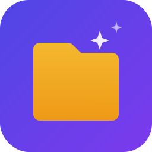

# Nebula Files

<p align="center">
  
</p>

<p align="center">
  <strong>A modern, feature-rich file manager for Linux</strong>
</p>

<p align="center">
  <a href="#installation">Installation</a> •
  <a href="#features">Features</a> •
  <a href="#themes">Themes</a> •
  <a href="#screenshots">Screenshots</a> •
  <a href="#building">Building</a>
</p>

---

## Installation

### Flathub (Recommended)
```bash
flatpak install flathub org.nebulaprojects.files
```

### Manual Install
```bash
git clone https://github.com/nebulaprojects/nebula-files.git
cd nebula-files
bash install.sh
```

### Dependencies
- Python 3.10+
- GTK4
- libadwaita
- python3-gobject
- rclone (optional, for cloud drives)
- expect (optional, for automated OneDrive setup)

## Features

**File Management**
- Tabbed browsing with independent navigation per tab
- Split view — two tabs side by side with drag-and-drop between panes
- Click-to-edit address bar with case-insensitive path resolution
- Spacebar Quick Look preview (images, text, code, PDFs, folders)
- File type filters: Images, Documents, Videos, Audio, Archives, Code
- Super Search across home directory and all mounted drives
- Drag and drop to/from external apps

**Cloud Drives**
- OneDrive integration with automated setup (no manual terminal steps)
- Google Drive integration via rclone
- Async loading with spinner for slow network mounts
- Account email display in sidebar

**Compression & Extraction**
- Create: ZIP, TAR.GZ, TAR.XZ, TAR.BZ2
- Extract: ZIP, TAR (all variants), 7z, RAR

**Customization**
- 5 themes with dark/light/blur variants
- Customizable accent colors with HSB sliders + hex input
- Multiple icon styles: System, Outline, Filled, Rounded
- Custom font picker
- 20+ remappable keyboard shortcuts
- UI scale adjustment
- Live settings preview before applying

**Properties**
- File icon + type header
- Size with exact byte count
- Folder contents count
- Created/Modified/Accessed timestamps
- Owner, Group, MIME type
- Interactive permission editor (Read/Write/Execute checkboxes)

## Themes

| Theme | Description |
|-------|-------------|
| **Nova** | Default modern look with blur effects |
| **macOS** | Inspired by macOS Finder |
| **Windows 11** | Authentic Windows Explorer replica (separate optimized app) |
| **Minimal** | Clean, distraction-free design |
| **Retro** | Classic retro aesthetic |

Each theme supports Light, Dark, and Blur display modes.

## Screenshots

*Screenshots coming soon — take a screenshot of each theme and add to the `screenshots/` folder.*

## Keyboard Shortcuts

| Shortcut | Action |
|----------|--------|
| `Ctrl+T` | New Tab |
| `Ctrl+W` | Close Tab |
| `Ctrl+C` | Copy |
| `Ctrl+V` | Paste |
| `Ctrl+Z` | Undo |
| `Space` | Quick Look |
| `Ctrl+I` | Properties |
| `Ctrl+F` | Search |
| `Ctrl+\` | Toggle Split View |
| `F5` | Refresh |
| `Ctrl+Shift+Z` | Compress |
| `Delete` | Delete |

All shortcuts are customizable in Settings → Keyboard Shortcuts.

## Building

### Flatpak
```bash
flatpak-builder --force-clean build flatpak/org.nebulaprojects.files.yml
flatpak-builder --install --user build flatpak/org.nebulaprojects.files.yml
```

### Run from source
```bash
python3 src/nebula-files-launcher.py
```

## Project Structure

```
nebula-files/
├── src/
│   ├── nebula-files.py          # Main app (Nova/macOS/Minimal/Retro themes)
│   ├── nebula-files-win11.py    # Windows 11 theme (separate optimized app)
│   └── nebula-files-launcher.py # Theme-aware launcher
├── data/
│   ├── org.nebulaprojects.files.desktop
│   ├── org.nebulaprojects.files.metainfo.xml
│   └── icons/
├── flatpak/
│   └── org.nebulaprojects.files.yml
├── screenshots/
├── install.sh
└── README.md
```

## License

GPL-3.0-or-later

## Contributing

Contributions welcome! Please open an issue or pull request on GitHub.
